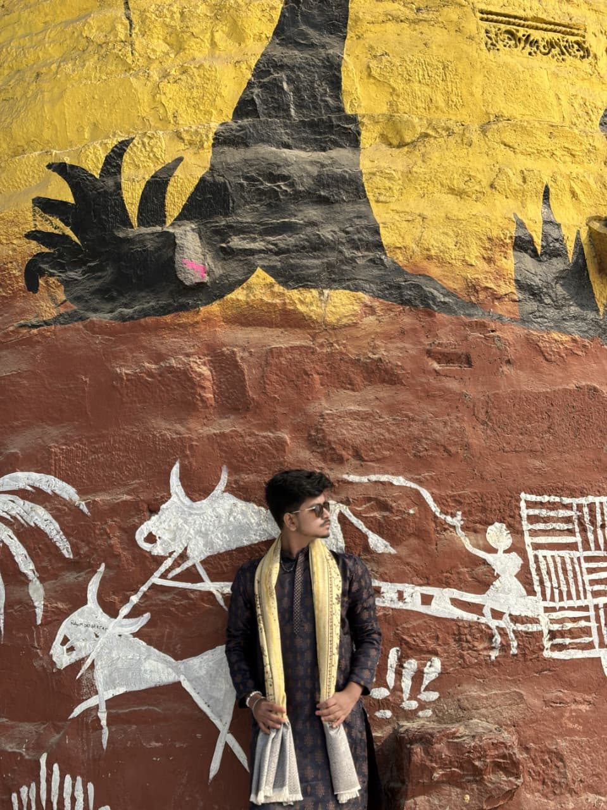

# 🌌 ALOK KUMAR SAHU — Cinematic Developer Portfolio

<p align="center">
  <a href="https://alokkumarsahu.in" target="_blank">
    
  </a>
  
  
  
  
</p>

---

## 👤 Developer Profile

<table>
  <tr>
    <td width="200px" align="center" valign="top">
      
    </td>
    <td valign="top">
      <h3>Alok Kumar Sahu</h3>
      <p><b>Software Engineer & AI Builder</b></p>
      <p>B.Tech Computer Science student at Veer Surendra Sai University of Technology (VSSUT), Burla (Class of 2028). I approach software engineering not just as code execution, but as product building — ensuring high-end responsiveness, scalable databases, and contextual AI capabilities.</p>
      <p>
        <a href="https://alokkumarsahu.in" target="_blank"></a>
        <a href="https://github.com/alokkumar2510" target="_blank"></a>
        <a href="https://www.linkedin.com/in/alok-kumar-sahu-7a7059370/" target="_blank"></a>
        <a href="mailto:alok.vssut28@gmail.com"></a>
      </p>
    </td>
  </tr>
</table>

---

## 🚀 Key Features

* **🎥 Cinematic Video Hero**: Fullscreen high-definition video backgrounds with custom typography overlays.
* **🪐 Three.js Tech Galaxy**: Interactive 3D particle systems and orbital skill categories built with React Three Fiber.
* **📱 Premium Glassmorphism UI**: High-fidelity dark mode with tailored HSL glow highlights, responsive layouts, and a custom interactive cursor.
* **⚡ Live Site Iframe Previews**: Integrated, rate-limit-free iframe previews of deployed project applications directly inside mock browser frames.
* **🪄 Framer Motion & GSAP Choreography**: Ultra-smooth page transitions, magnetic buttons, and scroll-driven timeline animations.
* **📜 Unified Data Config**: Entire portfolio content (profile, metrics, projects, journey timeline) loaded dynamically from a single source of truth.

---

## 🛠️ Tech Stack

* **Core Framework:** Next.js 14 (App Router, Static Site Export)
* **Logic/Type Safety:** TypeScript, React 18+
* **Styling:** Tailwind CSS, Vanilla CSS, CSS Variables for HSL color system
* **3D & Animation:** Three.js, React Three Fiber (R3F), Drei, Framer Motion, GSAP (ScrollTrigger)
* **Scrolling:** Lenis Smooth Scroll
* **Deployment:** Cloudflare Pages (with custom domains)

---

## 📁 Project Structure

```
public/
  images/
    avatar.png             # Navbar profile avatar
    alok_pfp.jpeg          # Developer profile photo
  videos/
    hero.mp4               # Fullscreen video background
  resume.pdf               # Downloadable CV
src/
  app/                     # Next.js App Router root layout & metadata
  components/
    loader/                # Boot sequence preloader
    hero/                  # Fullscreen video hero section
    about/                 # Scroll-triggered bio section
    skills/                # Interactive Three.js Tech Galaxy
    projects/              # Project showcase with interactive iframes
    achievements/          # Timeline achievements list
    timeline/              # Educational & career timeline path
    contact/               # Glassmorphism contact form
    three/                 # WebGL canvas setups (NeuralNet, TechSphere)
    ui/                    # Custom elements (MagneticButtons, CustomCursor)
    layout/                # Navbar, Footer
  data/                    # portfolio.ts (Central project/profile configuration)
```

---

## 💻 Local Setup & Development

### 1. Prerequisites
* Node.js v18+
* npm or yarn

### 2. Installation
```bash
# Clone the repository
git clone https://github.com/alokkumar2510/alok-portfolio.git
cd alok-portfolio/portfolio

# Install dependencies
npm install
```

### 3. Run Development Server
```bash
npm run dev
```
Open [http://localhost:3000](http://localhost:3000) to view the application locally.

### 4. Build Production Bundle
```bash
npm run build
```
The static export will be compiled inside the `out/` folder, ready for deployment.

---

## 🌐 Deployment to Cloudflare Pages

This site is configured for direct manual deployment using the Cloudflare Wrangler CLI:

```bash
# Upload and deploy to Cloudflare Pages
npx wrangler pages deploy out --project-name alok-portfolio
```

---

## 🛡️ License

This project is open-source and licensed under the MIT License.

*Built with 🌌 and ⚡ by [Alok Kumar Sahu](https://alokkumarsahu.in)*
